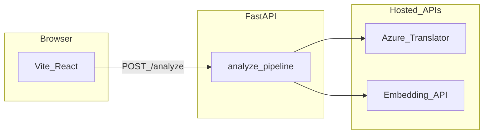

# PivotDrift

**Cross-lingual meaning drift** — measure how much a short text changes when it is translated through **two different pivot languages** and back to the source language, with **segment-level** semantic (embedding cosine) and **surface** (normalized edit distance) metrics.

## What it does

1. You provide **source text** (up to 800 characters by default), a **source language** code, and **exactly two pivot** language codes.
2. The backend calls **Azure AI Translator** twice per pivot: `source → pivot → source`, producing two **back-translations**.
3. Text is **split into segments** (sentences when possible; otherwise fixed windows). If segment counts disagree after round-trip, the pipeline **falls back** to a single segment for the whole text (see Limitations).
4. For each segment, the service computes:
   - **Cosine similarity** between embeddings of the original segment and each back-translated segment (same embedding model for both).
   - **Surface similarity** = \(1 - \text{Levenshtein} / \max(\text{len}))\), a simple string-level proxy.
5. **Summary statistics** include mean cosine per pivot and **cross-pivot gap** (absolute difference of those means), plus a coarse **risk** label (`low` / `medium` / `high`) from heuristic thresholds.

**Example intuition:** Negation, idioms, intensifiers, and culturally loaded wording often show **lower cosine** or **larger disagreement between pivots** than plain factual sentences — making failures of “translation as a lossless codec” visible.

## Why it exists

Multilingual pipelines (MT, cross-lingual retrieval, localized moderation) often assume **semantic preservation** under translation. In practice, **round-trip error** is **language-pair-dependent** and **non-deterministic** in aggregate. PivotDrift is a small **analysis probe**: it does not train models; it **surfaces instability** you can discuss, screenshot, or export as JSON for qualitative research.

## Architecture

- **Backend:** Python [FastAPI](https://fastapi.tiangolo.com/) — `POST /analyze`, `GET /health`, OpenAPI at `/docs`.
- **Translation:** [Azure AI Translator](https://azure.microsoft.com/products/ai-services/translator/) REST API v3 (cloud only; no local MT).
- **Embeddings:** Configurable **OpenAI** (`text-embedding-3-small` by default) or **Google Gemini** (`text-embedding-004`) via `EMBEDDING_PROVIDER` — cloud only.
- **Frontend:** [Vite](https://vitejs.dev/) + [React](https://react.dev/) (TypeScript) — single-page UI, dark theme, JSON export.



## Tech stack

| Component   | Notes |
|------------|--------|
| Python     | 3.10+ recommended (Dockerfile uses 3.11) |
| Node.js    | 20+ for Vite 8 |
| Azure      | Translator resource + key + region |
| Embeddings | OpenAI API key **or** Google AI Studio key |

**Pricing:** Azure Translator and cloud APIs change over time — verify current **free tiers** and quotas in the provider consoles before deploying. This project is intended for **low traffic** demos.

## Quickstart (local)

### 1. Clone and configure the API

```bash
cd backend
python3 -m venv .venv
source .venv/bin/activate   # Windows: .venv\Scripts\activate
pip install -r requirements.txt
cp ../.env.example .env
# Edit .env: set AZURE_TRANSLATOR_KEY, AZURE_TRANSLATOR_REGION, and either OPENAI_API_KEY or GEMINI_API_KEY + EMBEDDING_PROVIDER=gemini
```

### 2. Run the API

From the `backend` directory (so `app` resolves and `.env` is found):

```bash
uvicorn app.main:app --reload --host 127.0.0.1 --port 8000
```

### 3. Run the frontend

In a second terminal:

```bash
cd frontend
npm install
npm run dev
```

The Vite dev server proxies **`/api` → `http://127.0.0.1:8000`**, so the UI calls `/analyze` as `/api/analyze` with no extra config.

### 4. Sample `curl`

```bash
curl -s -X POST http://127.0.0.1:8000/analyze \
  -H "Content-Type: application/json" \
  -d '{"text":"I do not think this is terrible.","source_lang":"en","pivot_langs":["es","ja"]}' | jq .
```

### 5. Tests (no API keys)

```bash
cd backend
pytest -q
```

Example prompts for manual exploration live in [`backend/examples.json`](backend/examples.json).

## Configuration

| Variable | Purpose |
|----------|---------|
| `AZURE_TRANSLATOR_KEY` | Azure Translator subscription key (**required**) |
| `AZURE_TRANSLATOR_REGION` | Resource region (e.g. `eastus`) — required for most keys |
| `AZURE_TRANSLATOR_ENDPOINT` | Optional; default global `https://api.cognitive.microsofttranslator.com` |
| `EMBEDDING_PROVIDER` | `openai` (default) or `gemini` |
| `OPENAI_API_KEY` | Required if provider is `openai` |
| `OPENAI_EMBEDDING_MODEL` | Default `text-embedding-3-small` |
| `OPENAI_BASE_URL` | Default `https://api.openai.com/v1` |
| `GEMINI_API_KEY` | Required if provider is `gemini` |
| `GEMINI_EMBEDDING_MODEL` | Default `text-embedding-004` |
| `FRONTEND_ORIGINS` | Comma-separated CORS origins for production |
| `MAX_INPUT_CHARS` | Max input length (default `800`) |

**Language codes** must match [Azure Translator language support](https://learn.microsoft.com/azure/ai-services/translator/language-support) (e.g. `en`, `es`, `ja`, `zh-Hans`).

## API reference

### `POST /analyze`

**Request body**

```json
{
  "text": "Your short text.",
  "source_lang": "en",
  "pivot_langs": ["es", "ja"]
}
```

**Response (conceptual)**

- `round_trips`: back-translation string for each pivot.
- `segments[]`: per-segment original text, back-translations per pivot, `cosine_by_pivot`, `surface_by_pivot`.
- `summary`: `mean_cosine_by_pivot`, `cross_pivot_gap`, `risk_level`.
- `meta`: `translator_id`, `embedding_provider`, `embedding_model_id` for reproducibility.

Interactive schema: run the API and open **`http://127.0.0.1:8000/docs`**.

### `GET /health`

Returns `{ "status": "ok" }` for load balancers.

## Limitations (read before citing this in applications)

- **Not ground truth:** Cosine on API embeddings is a **probe**, not an objective semantics metric. Different embedding models yield different numbers.
- **Translator bias:** All legs use **one** MT engine (Azure); systematic errors correlate across pivots.
- **Alignment:** v1 uses **ordered segment alignment**; when sentence counts diverge after round-trip, the service **collapses** to one segment — fine for demos, weak for long heterogeneous documents.
- **Length:** Designed for **short** user text; very long inputs are out of scope.
- **Risk label:** `low` / `medium` / `high` is a **heuristic** for UI affordance only.

## Ethics / misuse

PivotDrift is an **educational and analysis** tool. Do **not** use it as the sole basis for **employment, moderation, legal, or safety** decisions. Do not submit **sensitive personal data** you are not allowed to send to third-party APIs.

## Deployment (free-tier friendly)

**Backend**

- Build context directory: `backend/` (contains `Dockerfile` and `app/`).
- Example platforms: [Render](https://render.com/) (Docker Web Service), [Fly.io](https://fly.io/), [Railway](https://railway.app/).
- Set the same environment variables as in `.env.example`.
- Set `FRONTEND_ORIGINS` to your real site origin (comma-separated).

**Frontend**

- [Vercel](https://vercel.com/) or [Cloudflare Pages](https://pages.cloudflare.com/): root `frontend/`, build `npm run build`, output `dist`.
- Set **`VITE_API_BASE`** to the public API origin (e.g. `https://your-api.onrender.com`) **without** a trailing slash. The UI will call `${VITE_API_BASE}/analyze`.

**CORS:** The API only allows origins listed in `FRONTEND_ORIGINS`.

## Next improvements planned

- **Task-aware lexical flags:** small curated lexicons (negation, intensifiers, sentiment-laden words) plus character-diff windows to flag segments where polarity might have shifted across round-trip.
- **Optional bounded LLM explanations:** a single structured call to explain **top-k** flagged segments, explicitly framed as **hypotheses for human review** (not authoritative labels).
- **Third pivot or second translator** in the UI for ablation-style comparison.
- **Batch endpoint** or CSV upload for small curated evaluation sets.

---

**Tagline:** *See how meaning shifts when your text travels through two languages and back.*

**Demo:** Paste a short sentence, pick two pivots, and inspect where embeddings and surface metrics diverge — export JSON for notebooks or appendices.
